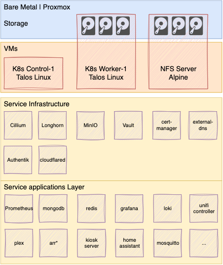

# homelab

Collection of resources to setup a functional homelab based on proxmox virtual machines running a kubernetes environment. The image below summarizes the setup.

This setup assumes it will be ran on a proxmox environment. The main advantages are the ease to create and destroy vms to change the cluster configuration as needed. The state of the cluster is maintained
through terraform by editing a single [config file](talos_provisioning/configs.auto.tfvars.json).

## tech stack

Provisioning
- proxmox: hypervisor operating system
- terraform: for automated provisioning
  
Plaform
- kubernetes: container orchestration
- talos linux: stateless kubernetes operating system
  
Storage
- longhorn: block storage for kubernetes services
- minio: S3 compatible object store
  
Network
- cilium: CNI for kubernetes
- cloudflared: to create cloudflare tunnels to the services and the infrastructure itself
- cert-manager: certificate manager for kubernetes
- external-dns: synchronizes services with DNS providers
  
Auth and secrets
- vault: manage secrets and other sensitive data
- authentik: self hosted SSO solution

Monitoring Stack
- Grafana: visualization
- Mimir: metrics db
- loki: logs db
- alloy: monitoring tooling
