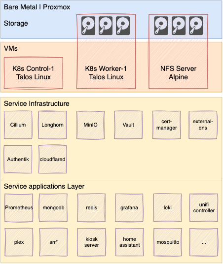

# homelab

A 2-node Proxmox cluster (Olympus) running a small VM tier plus a Talos
Kubernetes cluster (hal9000), fully in code. See the image below for the
high-level layout, and [`CLAUDE.md`](CLAUDE.md) for the current
architecture, conventions, and open priorities in detail.

## tech stack

Provisioning
- Proxmox: hypervisor
- Terraform: VM + Talos cluster provisioning (`infra/{olympus,hal9000}/terraform`)

Platform
- Kubernetes (Talos Linux) for apps — manifests in `kubernetes/`
- Static Docker Compose per VM for core services (Vault, Postgres,
  Authentik, Omni) — `infra/olympus/services/`

Networking (K8s)
- MetalLB: layer-2 load balancer
- NGINX Gateway Fabric: Gateway API ingress
- external-dns, cert-manager: DNS + TLS automation

Storage
- Longhorn: block storage for K8s
- NFS (from Hades) for larger media/photo volumes

Auth and secrets
- Vault: PKI + secrets, synced into K8s via vault-secrets-operator
- Authentik: SSO

## Repo layout

- `infra/olympus/terraform/`, `infra/hal9000/terraform/` — VM/cluster provisioning
- `infra/olympus/services/` — static compose files for the VM tier
- `kubernetes/` — manifests for the hal9000 cluster
- `.claude/context/` — detailed, living infra docs (network, services,
  storage, deployment, backup, todos)

No secrets are committed — `.env` per VM stays on the VM (gitignored,
`.env.example` tracked for the variable names); everything else lives in
Vault. See `.gitignore` before adding anything under `infra/`.
